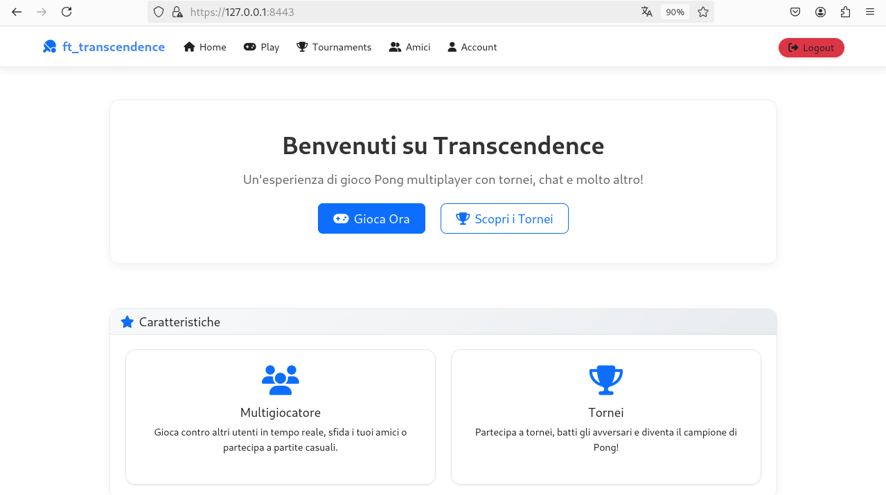
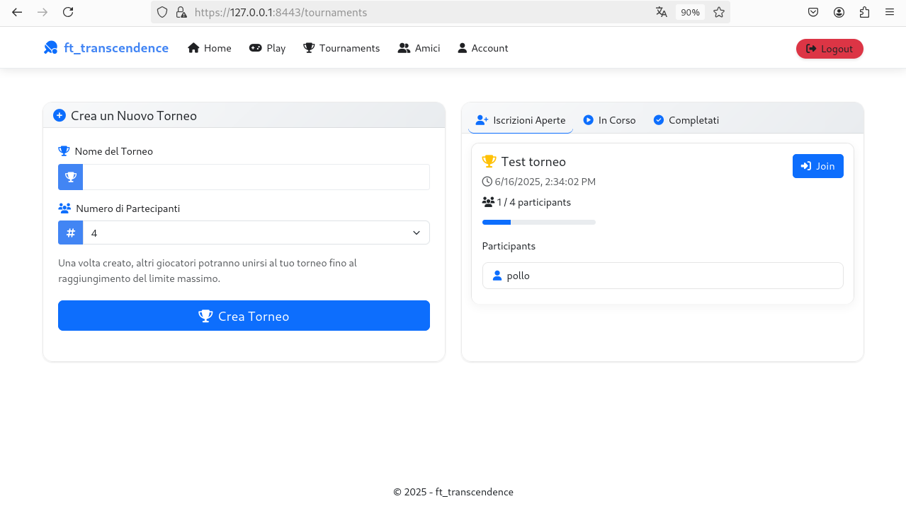
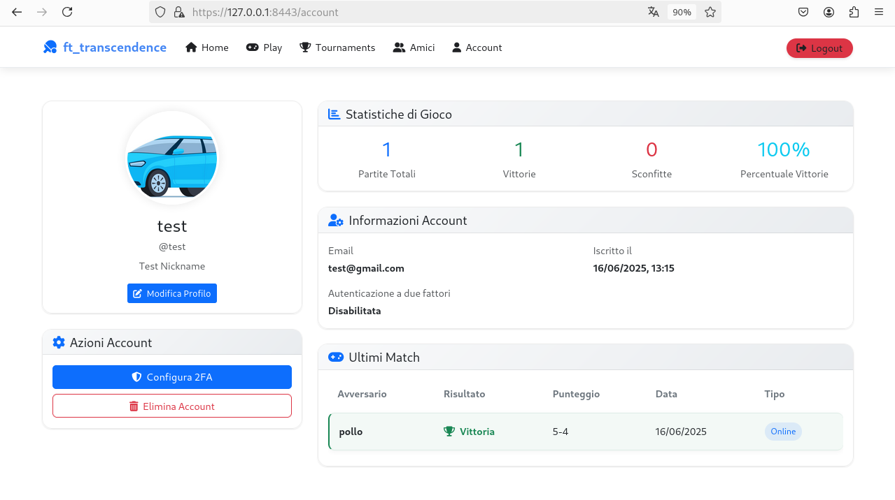

# 🕹️ ft_transcendence

**ft_transcendence** è una piattaforma web interattiva progettata per ospitare tornei del classico gioco *Pong* con funzionalità moderne e avanzate. Il progetto unisce componenti full-stack, sicurezza robusta, multiplayer remoto, intelligenza artificiale e integrazione con la blockchain per garantire trasparenza e innovazione.

---

## 🚀 Funzionalità Principali

- 🎮 **Gioco Pong multiplayer in tempo reale**
- 🧠 **Avversario AI** che simula un comportamento umano
- 🌍 **Giocatori remoti** da dispositivi diversi
- 🔐 **Autenticazione sicura con JWT + 2FA**
- 🧾 **Punteggi registrati sulla Blockchain Ethereum**
- 👥 **Gestione avanzata degli utenti** (profili, avatar, amici, cronologia)
- 📈 **Statistiche e dashboard personalizzate**
- 🔗 **Login con provider esterni via OAuth 2.0**

---

## 🛠 Stack Tecnologico

| Componente     | Tecnologia            |
|----------------|------------------------|
| **Backend**     | Django (Python)        |
| **Frontend**    | HTML5, CSS3, JavaScript (vanilla + Bootstrap) |
| **Database**    | PostgreSQL             |
| **Cache**       | Redis                  |
| **Web Server**  | Nginx                  |
| **Container**   | Docker & Docker Compose |
| **Blockchain**  | Node.js + Solidity su testnet Ethereum |

---

## ⚙️ Configurazione

Clona il repository:

```bash
git clone https://github.com/mttgvnrd/Transcendence.git
cd Transcendence
```

Crea un file `.env` nella root del progetto con le seguenti variabili:

```env
POSTGRES_USER=your_postgres_user
POSTGRES_PASSWORD=your_postgres_password
POSTGRES_DB=transcendence_db
REDIS_HOST=redis
SECURE_SSL_REDIRECT=False
CSRF_COOKIE_SECURE=False
SESSION_COOKIE_SECURE=False
DEBUG=True
BLOCKCHAIN_SERVICE_TOKEN=your_token
```

Avvia i servizi con Docker Compose:

```bash
docker-compose up --build
```

---

## 🌐 Accesso all'Applicazione

- Frontend: [http://localhost:8443](http://localhost:8443)

---

## 🔐 Sicurezza

- Implementazione HTTPS/SSL
- Protezione CSRF
- Autenticazione a due fattori (2FA)
- ModSecurity WAF configurato su Nginx
- Gestione sicura dei token con JWT

---

## 📦 Struttura del Progetto

```
Transcendence/
├── docker-compose.yml
├── docker-nginx/          # Configurazione e assets frontend
├── docker-django/         # Applicazione backend Django
├── docker-postgres/       # Configurazione database
├── docker-blockchain/     # Servizio blockchain
└── README.md
```

---

## 📸 Screenshot

### 🖥️ Homepage


### 🏆 Lobby del Torneo


### 🎮 Profile

